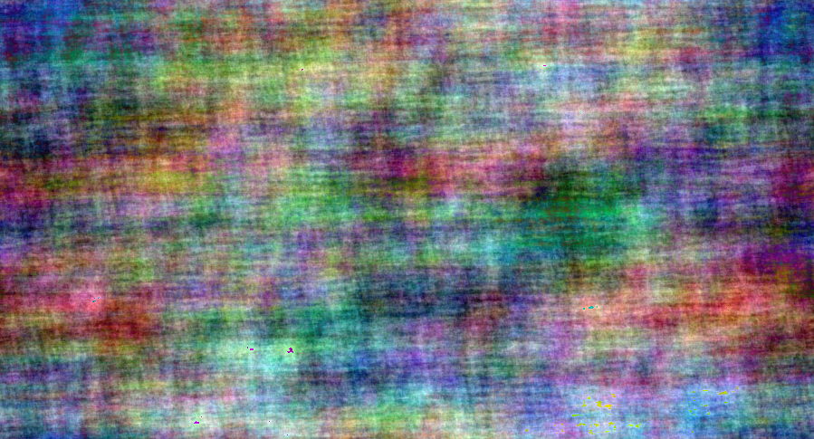

# randphase
Python functions for generating phase-randomised images of text. Fourier transform is used to extract amplitude. Inverse Fourier transform is used to generate an image with the same amplitude spectrum but with phase generated from normally or uniformly distributed noise.

## Drawing Text

The `draw.text()` function can be used to create an image of text.

```python
import draw
text_im = draw.text('erudition', size=50)
text_im.show()
```


This can be cropped to the extremities of the target text (as above), or to the maximum size available to the given number of ascii characters for the target font (for x and y separately).

```python
<<<<<<< HEAD
crop1 = draw.text('brine', size=50, crop_x = 'font', crop_y='font')
crop2 = draw.text('bring', size=50, crop_x = 'font', crop_y='font')
crop3 = draw.text('WWWWW', size=50, crop_x = 'font', crop_y='font')
crop1.show()
crop2.show()
crop3.show()
=======
import phase
rp = phase.randomise(raw, noise='normal')
rp.show()
>>>>>>> ef3d113e40dc71897e47ef066ae2d2ec10c2de75
```


You can also use different fonts, colours, backgrounds, and alignment (British spelling for 'centre' and 'colour').

```python
text_spec = draw.text('fancy', font='BRUSHSCI.TTF', colour=(255,127,0),
                      bg=(100,0,100), size=125, crop_x='font', align_x='centre')
text_spec.show()
```


## Randomising Phase

To randomise the phase of an image with normally distributed noise, use `phase.randomise()`.

```python
import phase
rp_im = phase.randomise(text_im, noise='normal')
text_im.show()
rp_im.show()
```


This will work on text generated by `draw.text()`, or any other PIL image. If the image has RGB channels, phase will be randomised across colour channels.

```python
from PIL import Image
luke = Image.open(op.join('img', 'luke.png'))
luke_rp = phase.randomise(luke)
luke.show()
luke_rp.show()
```




## Dependencies

* `PIL`
* `numpy`
